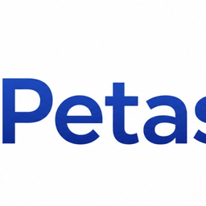

<p align="center">
  
</p>

<h1 align="center">Connect AI v2 (P-Reinforce)</h1>

<p align="center">
  <strong>100% Local · 100% Offline · Autonomous Knowledge Engine</strong><br/>
  VS Code / Cursor 확장 프로그램으로, 당신의 낡은 IDE를 최상위 에이전트 대학(A.U)의 심장으로 진화시킵니다.
</p>

<p align="center">
  
  
  
  
</p>

---

## 🌟 Overview: The P-Reinforce Architecture

Connect AI v2.89.158은 단순한 코딩 에이전트를 넘어섭니다. **P-Reinforce 아키텍처**를 기반으로 설계된 이 에이전트는 사용자의 모든 정보와 지시를 받아들여 **스스로 의미를 분석하고, 폴더를 생성하고, 마크다운 위키 파일로 정리하여 클라우드에 자동 백업**하는 자율 지식 정원사(Autonomous Gardener)입니다.

---

## ⚡ Core Features

### 1. 🧠 Agent University (A.U) 완벽 연동
Agent University 웹 플랫폼과 실시간으로 통신합니다. 
웹에서 버튼 한 번 누르는 즉시, 로컬 VS Code의 `4825` 포트를 통해 프리미엄 브레인 팩(Premium Brain Pack) 지식이 로컬 인공지능 뇌(`~/.connect-ai-brain`)에 자동 주입되어 신경망을 확장합니다.

### 2. 📂 자율 지식 구조화 (Zero-Interaction Styling)
유저가 던져주는 원시 데이터(Raw Data)를 에이전트가 스스로 판단해 `10_Wiki`, `00_Raw`, `🚀 Skills` 와 같은 완벽한 P-Reinforce 템플릿 규격의 Markdown 파일로 분할-조립하여 저장합니다.

### 3. ☁️ 클라우드 동기화 (Auto-Git Sync 100%)
로컬 PC에서 파일 생성이 일어나는 순간, 에이전트가 스스로 GitHub 저장소에 `git add`, `commit`, `push`를 수행합니다. 
마스터는 이제 지루한 푸시 커맨드를 입력할 필요가 없습니다.

### 4. 🔗 설치형 모델 자동 감지 (Dynamic Model Detection)
Ollama 또는 LM Studio에 설치된 모델을 내부 API(`v1/models`)를 호출하여 자동 감지하고, UI의 스위치 보드(드롭다운)에 연결합니다. 어떤 모델을 쓸지 번거롭게 입력하지 마십시오.

---

## ⚒️ Agent Capabilities (에이전트 권한)

로컬 머신의 파일 시스템과 터미널에 대한 통제권을 인공지능에게 부여합니다. (100% 안전한 권한 승인 기반)

| Action | Description |
|:--|:--|
| **📄 Create Files** | 새로운 파일과 폴더를 생성합니다 |
| **✏️ Edit Files** | 기존 파일 내의 코드를 수정합니다 |
| **🗑️ Delete Files** | 불필요한 파일을 즉각 파쇄합니다 |
| **📖 Read Files** | 마스터의 프로젝트 파일을 읽어 맥락을 파악합니다 |
| **📂 Browse Directories** | 디렉토리 구조를 분석합니다 |
| **🖥️ Run Commands** | `npm run build`, `git push` 등 터미널 명령을 수행합니다 |

---

## 📥 Installation (설치 방법)

### A.U 멤버십 유저 (Recommended)
1. 상단 탭의 [Releases](https://github.com/wonseokjung/connect-ai/releases) 메뉴로 진입.
2. 최신 `connect-ai-lab-2.89.158.vsix` 파일을 다운로드.
3. VS Code 에서 `Cmd+Shift+P` → **Extensions: Install from VSIX** → 다운받은 파일 선택

### 개발자 빌드 (Build from Source)
```bash
git clone https://github.com/wonseokjung/connect-ai.git
cd connect-ai
npm install
npm test
npm run qa:all
npm run package:vsix
```

Codex로 작업할 때는 루트 `AGENTS.md`를 기준으로 프로젝트 구조와 검증 명령을 확인합니다.

### 전체 QA
```bash
npm run qa:all
```

`qa:all`은 임시 standalone 웹 서버를 띄운 뒤 정적/보안 QA, 컴파일, 라이브 e2e, VSIX 패키징, 패키지 QA를 순서대로 실행합니다. `CONNECT_AI_QA_BASE_URL`을 지정하면 해당 서버로 e2e를 실행합니다. 오토 리서치 경로는 fixture, 빈 결과, 오류 상태, 실제 웹 검색 응답 계약, 출처 저장/export까지 검증합니다.

### 웹사이트로 실행 (VS Code 없이)
```bash
npm install
npm run web
```

브라우저에서 `http://127.0.0.1:8788`을 열면 Connect AI를 standalone 웹 앱으로 사용할 수 있습니다. 이 모드는 VS Code 확장 호스트를 사용하지 않고, 로컬 Node 서버가 LM Studio/Ollama와 두뇌 폴더를 직접 연결합니다.

---

## ⚙️ Engine Setup (엔진 설정 방법)

### ✅ LM Studio (Apple Silicon, Windows) - 권장
1. [lmstudio.ai](https://lmstudio.ai/) 에서 설치
2. Gemma 3, Llama 3 또는 Qwen Coder 등 원하는 모델 로드
3. **Developer 탭(좌측 `<>` 메뉴)** 진입 후 **Start Server** 클릭
4. Connect AI의 ⚙️ 채팅방 설정에서 엔진을 "LM Studio"로 선택 (자동 모델 인덱싱 완료)

### ✅ Ollama (Mac, Linux)
```bash
brew install ollama
ollama pull gemma3   # 원하는 모델 풀링
```
Connect AI에서 설정만 "Ollama"로 바꿔주시면 끝납니다.

---

## 🔒 Privacy (완벽한 보안)

- **Zero Cloud API:** 당신의 코드는 외부 클라우드 통신망을 타지 않습니다.
- **Zero Telemetry:** 모든 연산력은 100% Local Inference 환경에서 이루어집니다.
- 기업 보안 등급에 준하는 극강의 밀폐형 로컬 지식망 생성을 보장합니다.

---

<p align="center">
  <strong>Codex-ready for VS Code / Cursor & Agent University</strong><br/>
  Designed by <a href="https://github.com/wonseokjung">Jay</a> × Connect AI Architect
</p>
